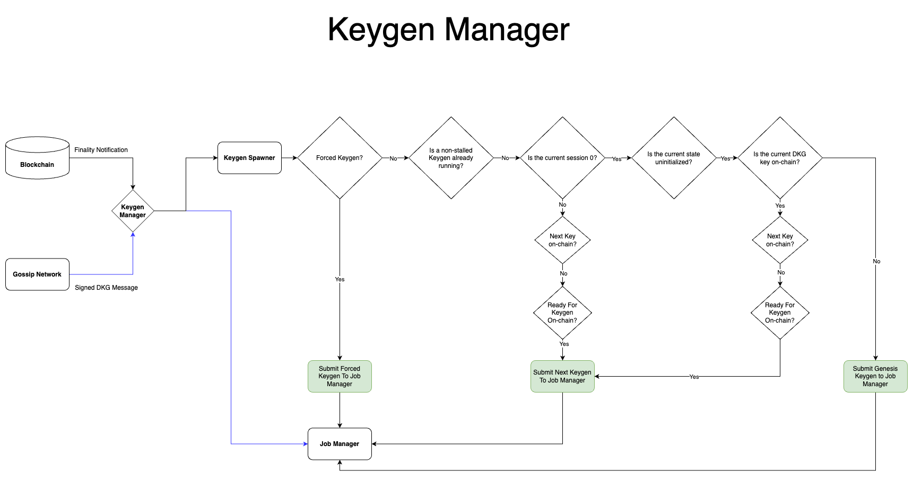

# Keygen Manager

## Introduction

The Keygen Manager is designed to simplify and manage the spawning and execution of Keygen protocols. Unlike its predecessor, it includes message enqueuing to ensure synchronicity between DKG nodes, as well as simpler to follow logic.

## Design
The Keygen Manager primarily consists of two integral components: The Keygen Manager itself and the Job Manager. The former acts as a bridge between the DKG worker and the Job Manager, while the latter takes on the responsibility of enqueueing, executing, handling, and managing stalled jobs.

### The DKG Worker
In relation to the Keygen Manager, the DKG Worker's task is to send finality notifications from the blockchain and signed DKG messages from the gossip protocol to the Keygen Manager.

### The Keygen Manager
When the DKG worker transmits a finality notification to the Keygen Manager, it first checks to see if we are forcing any keygen. If so, it removes the any potentially running jobs in the Job Manager and immediately starts a new job.

If a forced keygen is not required, it then checks to see if there are any currently running unstalled jobs. If there are, then we return. Otherwise, we check the current session.

If the current session is 0, we check to see if the local keygen state is uninitialized. If so, we then check to see if the *current* DKG public key is on-chain. If it is not, as is the case when first running a protocol, we start a new keygen that generates a key for session 0.
Otherwise, since the current key is on-chain, we then check to see if the next key is on-chain. If it is, we return. Otherwise, we then check to see if the blockchain is ready for a new keygen. If the blockchain is ready, we begin a keygen protocol to generate a key for session 1.

If the current session is not 0, e.g., session=`s`, we check to see if the next key (i.e., `s+1`) is on-chain. If so, we return. Otherwise, we check to see if the blockchain is ready for a new keygenn. If so, we begin a keygen protocol to generate a key for session `s+1`.

### The Job Manager (the background worker)
Unlike the background worker for the Signing Manager's job manager, the Keygen Manager opts-out of the background worker. Polling is done manually through the Keygen Manager.

### Receiving signed DKG messages
When the Job Manager receives signed DKG messages, it checks to see if it needs to deliver the message. If not, it enqueues the message for potential future keygen protocols.
