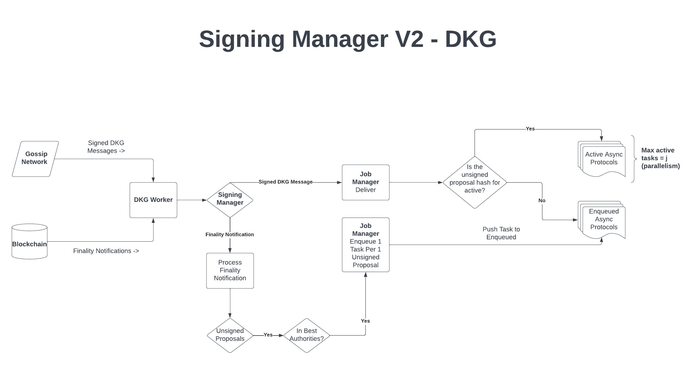

# Signing Manager V2

## Introduction

The purpose of the Signing Manager V2 is to streamline and improve reliability over Signing Manager V1.
Whereas in signing manager v1, we attempted to hack around the fact that messages were getting lost by starting many redundant async protocols,
in signing manager v2, we only start 1 async protocol per unsigned proposal and have eradicated the message loss problem as part of PR [#577](https://github.com/webb-tools/dkg-substrate/pull/577).

## Design
SigningManagerV2 is comprised of two primary components: The signing manager itself, which is a sort of an intermediary between the DKG worker
and the job manager, and the job manager, which is responsible for enqueueing, executing, managing, and handling stalled jobs.

### The DKG Worker
Relative to the Signing Manager, the DKG worker is responsible for sending finality notifications from the blockchain and signed DKG messages from the gossiping protocol to the signing manager.

### The Signing Manager
#### Unsigned Proposal Generation from Finality Notifications
When the DKG worker sends a finality notification to the signing manager, the signing manager will check if there are any unsigned proposals for the finalized block. If there are,
then, the signing manager will check to see if the current node is in the set of best authorities. If so, then, the signing manager will send these unsigned proposals to the job manager.

An important process of the former is the generation of the seed used for symmetrically calculating the signing set. This is done as follows:
* create a seed s where s is `keccak256`(`public_key`, `finality_notification_block`, `unsignedProposal`)
* take s and use it as a seed to random number generator.
* generate a t+1 signing set from this RNG
* if we are in this set, we send it to the signing manager

#### Signed DKG message handling
When the DKG worker sends a signed DKG message to the signing manager, the signing manager forwards these messages to the job manager for processing. It is up to the job manager to determine how to handle these messages

### The Job Manager
#### The background worker
Every 500ms, the `poll` function is executed. The `poll` function checks the set of active jobs, and sees if any have stalled or have finished. Stalled jobs are removed from the set of active jobs. It is up to a future finality notification to re-enqueue this job.

Nexr, `poll` checks the enqueued set of jobs associated with each unsigned proposal, and checks to see if any of these jobs need to be moved into the active set. If `j` active jobs may execute in parallel, and, there are `a` < `j` jobs running , then, `poll` will attempt to move at most `j` - `a` jobs from the enqueued set to the active set. When moved to the active set, the corresponding async protocols are also executed.

### Receiving unsigned proposals
When receiving unsigned proposals, the job manager takes the corresponding async protocol and *initializes* it. Initializing the protocol, as opposed ot *starting* it, means allowing the protocol to begin enqueueing messages. The protocol will not begin executing until the job manager starts it later in the `poll` function.
After initializing the protocol, the job manager will enqueue the job associated with the unsigned proposal, then immediately call `poll` to potentially immediately start the async protocol.

### Receiving signed DKG messages
When receiving signed DKG messages, the job manager will check to see if it needs to be delivered to any active or enqueued protocol. If delivery cannot be performed, then, there is the possibility that another node started a protocol ahead of the current node, meaning the current node will need to enqueue these messages in such a case.
Later, after the future corresponding protocol is *initialized*, the enqueued messages will be drained and sent to the appropriate protocol.

