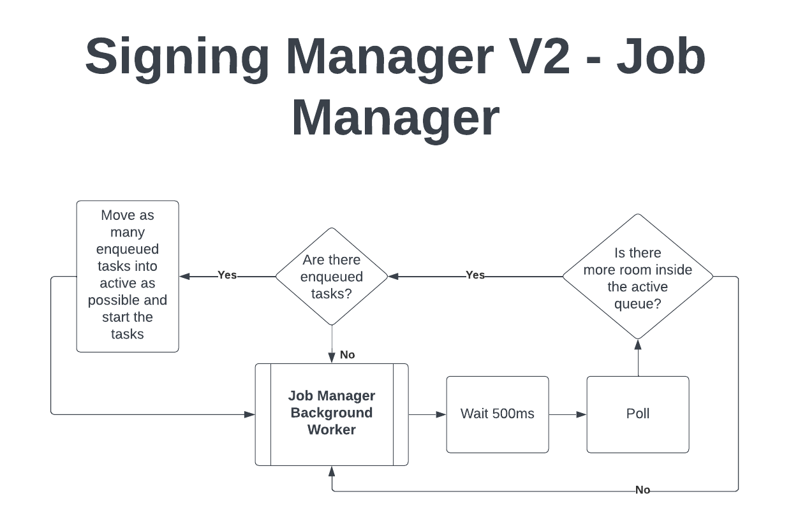

# Signing Manager

## Introduction

The Signing Manager is a robust system utilized to execute and manage the threshold-signing protocols over cross-chain messages. It is specifically designed to be efficient, reliable, and fast in protocol execution, message signing, and job completion.

## Design
The Signing Manager primarily consists of two integral components: The Signing Manager and the Job Manager. The former acts as a bridge between the DKG worker and the Job Manager, while the latter takes on the responsibility of enqueueing, executing, handling, and managing stalled jobs.

### The DKG Worker
In relation to the Signing Manager, the DKG Worker's task is to send finality notifications from the blockchain and signed DKG messages from the gossip protocol to the Signing Manager.

### The Signing Manager
When the DKG worker transmits a finality notification to the Signing Manager, it checks for any unsigned proposals for the finalized block. If any exist, the Signing Manager verifies if the current node is within the set of best authorities. If confirmed, the Signing Manager forwards these unsigned proposals to the Job Manager.

A crucial part of this process is the creation of the seed, which is used to symmetrically calculate the signing set. This process entails:

1. The creation of a seed s where s is derived from the keccak256 algorithm applied to the public_key, finality_notification_block, and unsignedProposal.
2. Utilizing s as a seed to a random number generator.
3. Generating a t+1 signing set from this RNG.
4. If the node is in this set, sending it to the signing manager.

When the DKG worker delivers a signed DKG message to the Signing Manager, these messages are forwarded to the Job Manager for processing.

### The Job Manager (the background worker)

This background worker executes the `poll` function every 500ms. The `poll` function assesses the set of active jobs to identify if any have stalled or finished. Stalled jobs are removed from the set of active jobs.

The `poll` function also examines the enqueued set of jobs associated with each unsigned proposal and determines if any of these jobs need to be transitioned into the active set. If `j` active jobs may execute in parallel, and there are `a` < `j` jobs running, then `poll` attempts to shift at most `j` - `a` jobs from the enqueued set to the active set. When transitioned to the active set, the corresponding asynchronous protocols are also executed.

### Receiving unsigned proposals
When the Job Manager receives unsigned proposals, it takes the corresponding asynchronous protocol and initializes it. Initializing the protocol, as opposed to starting it, allows the protocol to begin enqueueing messages. The protocol will not commence execution until the Job Manager starts it later in the `poll` function. After initializing the protocol, the Job Manager enqueues the job associated with the unsigned proposal, then immediately executes the `poll` function to potentially start the asynchronous protocol immediately.

### Receiving signed DKG messages
When the Job Manager receives signed DKG messages, it checks if these need to be delivered to any active or enqueued protocol. If delivery is not possible, the messages are enqueued for future delivery. This could occur if another node has started a protocol ahead of the current node, necessitating the current node to enqueue these messages. Later, once the corresponding future protocol is initialized, the enqueued messages are drained and sent to the appropriate protocol.
